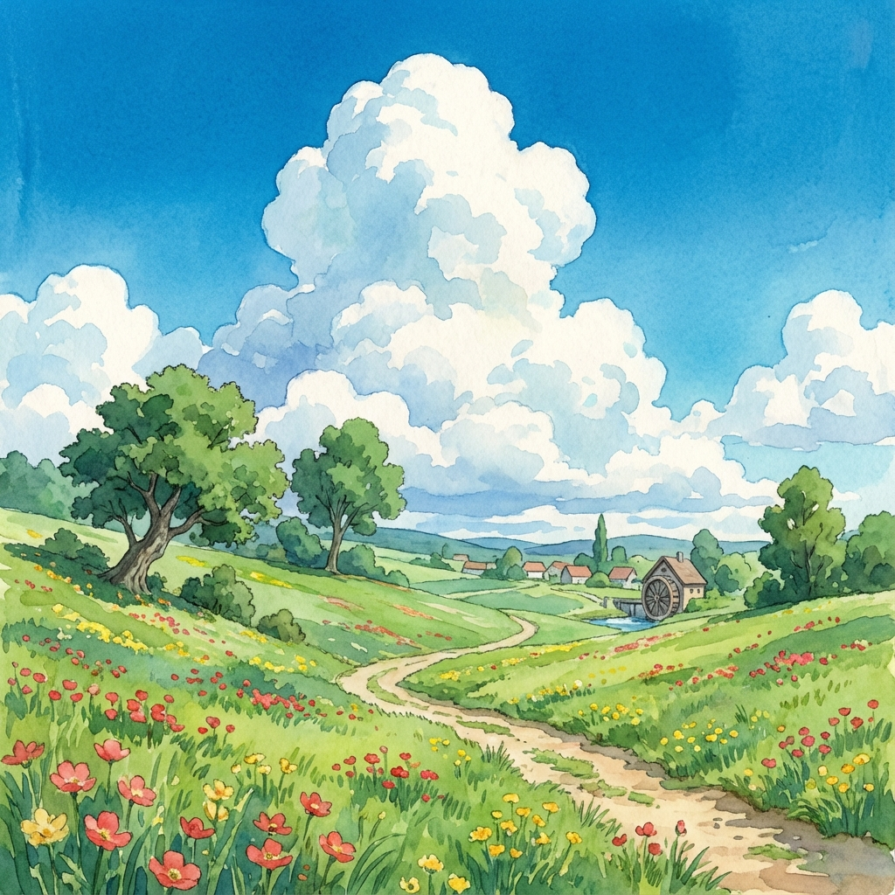

# 🌿 Forest Journey (Arkanoid Ghibli Theme)

A beautiful, Ghibli-inspired brick-breaking game built with vanilla JavaScript, HTML, and CSS.
Experience the magic of the forest with soothing visuals, dynamic physics, and exciting power-ups!

## 🎮 How to Play

- **Paddle Control**: Use `Left` / `Right` Arrow keys.
- **Launch Ball**: Press `Spacebar`.
- **Goal**: Destroy all bricks to proceed to the next level. Avoid letting the ball drop!

## ✨ Features

- **Ghibli Aesthetic**: Soft colors, round designs, and atmospheric visual effects.
- **Dynamic Physics**: Ball pushes out of bricks to prevent bugs, responsive paddle control.
- **Smart Responsive Design**:
  - **PC**: Wide 4:3 view.
  - **Mobile**: Tall 3:4 view optimized for one-handed play.
- **Item System**:
  - 🌿 **Expand**: Paddle gets wider.
  - 🍃 **Slow**: Ball speed decreases.
  - 🌰 **Multi-Ball**: Spawns extra balls.
  - 🛡️ **Safety**: Creates a bottom safety floor.
  - 🔥 **Fireball**: Balls pierce through bricks.
  - ✨ **Laser**: Paddle shoots magic bullets.

## 🛠️ Tech Stack

- **Core**: HTML5, CSS3, Vanilla JavaScript (No libraries)
- **Audio**: Web Audio API (Synthesized sounds, no external assets needed)

## 🚀 Deployment

Simply drag and drop this folder onto [Netlify Drop](https://app.netlify.com/drop) to host it for free!

---
*Created by Antigravity AI Assistant*
